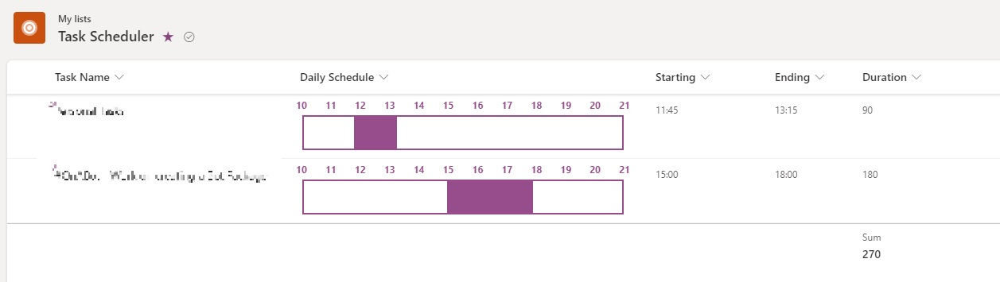

## About
This is a sample which shows the work duration for the day. It assumes that work starts at 10.00 AM and ends at 09:00 PM. The interval assumed is 1 hour so that we can visualize easily for the work period

### Sample Screen.
